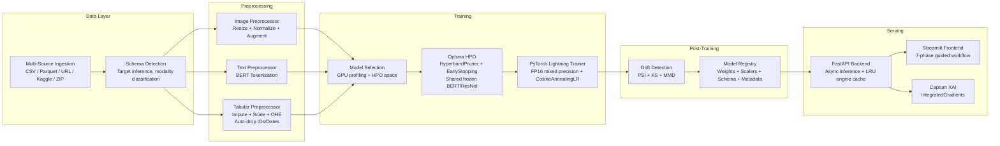

<p align="center">
  <h1 align="center">AutoVision+</h1>
  <p align="center">
    <strong>A Universal Multimodal AutoML Pipeline</strong><br>
    End-to-end automated machine learning for fused Image + Text + Tabular data,<br>
    with built-in hyperparameter optimization, drift detection, and explainability.
  </p>
</p>

<p align="center">
  
  
  
  
  
  
</p>

---

## Problem Statement

Training machine learning models on **multimodal data** (images, free-text, and structured tabular features) is an unsolved operational bottleneck:

1. **Data Fusion Friction** -- Most AutoML frameworks (Auto-sklearn, AutoGluon, FLAML) treat modalities in isolation. Practitioners must manually engineer cross-modal feature pipelines, reconcile preprocessing schemas, and build custom fusion heads -- a process that is error-prone and non-repeatable.

2. **Compute Waste During HPO** -- Standard Optuna/Ray Tune loops instantiate heavyweight pretrained encoders (BERT: ~440 MB, ResNet-50: ~100 MB) *per trial*, exhausting GPU VRAM after 2-3 trials and causing silent OOM crashes or "zombie" trials that leak GPU memory without contributing to the search.

3. **Feature Leakage at Scale** -- Raw datasets contain ID columns (`patient_id`, `ecg_id`), datetime stamps, and high-cardinality strings that survive default preprocessing pipelines. Models train on these noise features, achieve artificially high validation scores, and fail catastrophically in production.

4. **Black-Box Inference** -- After training, prediction UIs blindly ask users to fill in *every* column from the original dataset -- including the leaked IDs and dates the model never actually used -- while providing zero guidance on expected input schema.

**AutoVision+** solves all four problems within a single, opinionated 7-phase pipeline that automates the journey from raw multi-source data to deployed, explainable predictions.

---

## Scope

### What AutoVision+ Handles

- Automated schema detection across heterogeneous datasets (CSV, Parquet, image directories, ZIP archives, Kaggle datasets)
- Multimodal preprocessing: ResNet-50 for images, BERT tokenization for text, sklearn ColumnTransformer for tabular
- Heuristic auto-filtering of ID columns, datetime fields, and high-uniqueness noise before training
- Optuna HPO with HyperbandPruner and shared frozen encoders (single VRAM allocation)
- Dual fusion strategies: concatenation and learned attention-weighted fusion
- PyTorch Lightning training with mixed-precision (FP16), EarlyStopping, and stratified splits
- Statistical drift detection (PSI, KS, MMD) with autonomous retraining triggers
- Full artifact serialization (weights, scalers, tokenizers, schemas) to a versioned model registry
- Captum Integrated Gradients XAI with auto-targeting of the predicted class
- Schema-aware inference API and guided Streamlit frontend

### What It Excludes

- Distributed multi-GPU / multi-node training (single-device only)
- Out-of-core datasets exceeding RAM (Polars/Dask lazy references are supported but materialized in-memory for training)
- Audio, video, or time-series modalities
- Production deployment orchestration (Kubernetes, model serving infrastructure)
- Automated feature engineering (feature interactions, polynomial expansion)

---

## Competitive Edge

Existing open-source AutoML tools leave a critical gap in multimodal fusion:

| Capability | Auto-sklearn | AutoGluon | FLAML | **AutoVision+** |
|---|:---:|:---:|:---:|:---:|
| Tabular AutoML | Yes | Yes | Yes | Yes |
| Image + Text + Tabular Fusion | No | Partial | No | **Yes** |
| Shared Frozen Encoders in HPO | N/A | No | N/A | **Yes** |
| Automatic ID/Date Column Filtering | No | No | No | **Yes** |
| Schema-Guided Inference UI | No | No | No | **Yes** |
| Statistical Drift Detection (PSI/KS/MMD) | No | No | No | **Yes** |
| XAI Auto-Targeting (Captum IG) | No | No | No | **Yes** |

AutoVision+'s core differentiator is treating *the entire lifecycle* -- from raw data ingestion through drift-triggered retraining -- as a single automated pipeline, rather than a collection of disconnected notebooks. The 7-phase orchestrator ensures that preprocessing state, feature contracts, and model provenance are serialized atomically, eliminating the "training-serving skew" that plagues ad-hoc ML workflows.

---

## Architecture

### Pipeline Flow



### Tech Stack

| Layer | Technology |
|---|---|
| **Core ML** | PyTorch 2.0, PyTorch Lightning, torchvision (ResNet-50), HuggingFace Transformers (BERT), torchmetrics |
| **AutoML / HPO** | Optuna (HyperbandPruner), MLflow (experiment tracking) |
| **Preprocessing** | scikit-learn (ColumnTransformer, StandardScaler, OHE), Pandas, NumPy |
| **Drift Detection** | SciPy (KS test), custom PSI + MMD implementations |
| **Explainability** | Captum (IntegratedGradients) |
| **Backend API** | FastAPI, Uvicorn, Pydantic |
| **Frontend** | Streamlit, Altair, Plotly |
| **Data I/O** | aiohttp (async downloads), Polars/Dask (lazy loading), joblib (serialization) |

---

## Implementation & Engineering Challenges

### 1. FinOps: Eliminating "Zombie Trial" GPU Compute Leak

**Problem:** When Optuna's `HyperbandPruner` prunes an underperforming trial mid-training, the `TrialPruned` exception bypasses normal cleanup code. The pruned trial's Lightning module, CUDA tensors, and trainer graph remain allocated on the GPU -- a "zombie trial" that consumes VRAM without contributing to the search. After 2-3 pruned trials, the GPU is full and subsequent trials OOM.

**Solution** (`training_orchestrator.py:1285-1296`): The entire `objective()` function body is wrapped in `try/finally`. The `finally` block executes unconditionally -- on success, error, *and* `TrialPruned`:

```python
finally:
    del pl_trainer
    _is_best = bool(_best_module_ref) and _best_module_ref[0] is lightning_module
    if not _is_best:
        lightning_module.cpu()
        del lightning_module
    import gc; gc.collect()
    if torch.cuda.is_available():
        torch.cuda.empty_cache()
```

The best-performing module is preserved in-memory (`_best_module_ref`) while all other trial artifacts are aggressively deallocated. Combined with `HyperbandPruner` (`reduction_factor=3`) and Lightning `EarlyStopping` (`patience=5`), this ensures that the GPU budget is spent exclusively on promising hyperparameter configurations.

### 2. VRAM Optimization: Shared Frozen Encoders Across Optuna Trials

**Problem:** A standard HPO loop calls `ImageEncoder(pretrained=True)` and `TextEncoder()` inside every trial. With ResNet-50 (~100 MB) and BERT-base (~440 MB), this means ~540 MB of *identical, frozen* weights are duplicated N times on the GPU.

**Solution** (`training_orchestrator.py:1101-1122`): Frozen encoders are instantiated **once** before the Optuna study begins and injected into every trial via constructor arguments:

```python
_image_encoder = ImageEncoder(pretrained=True, freeze_backbone=True)
_image_encoder.eval()
for p in _image_encoder.parameters():
    p.requires_grad = False
_image_encoder.to(self.device)
# ... same for _text_encoder
```

Inside the `ApexLightningModule`, these are stored via `object.__setattr__` (`trainer.py:131-132`) to bypass `nn.Module.register_module()`, keeping them out of `state_dict()`, `parameters()`, and the optimizer. A custom `.to()` override (`trainer.py:352-365`) ensures they follow device placement correctly. This reduces per-trial VRAM overhead to only the lightweight fusion head (~2 MB), enabling 10+ HPO trials on a single consumer GPU.

### 3. UI/API Parity: Dynamic Schema Validation and Guided Inference

**Problem:** The raw training schema includes columns like `patient_id`, `ecg_id`, and `recording_date` that the preprocessor auto-filters. Without synchronization, the inference API expects these columns, the frontend asks users to fill them in, and payloads fail validation.

**Solution** (3-file contract):

1. **Preprocessor** (`tabular_preprocessor.py:26-31`): Heuristic ID/datetime detection via regex (`_ID_NAME_PATTERN`), uniqueness ratio thresholds (`>10%` for named IDs, `>90%` for unnamed), and `pd.to_datetime` probing. Surviving columns are saved as `_feature_names_in`; dropped columns as `_dropped_cols`.

2. **API** (`run_api.py:1416-1489`): The `/model-info/{model_id}` endpoint loads the fitted preprocessor from `tabular_scaler.joblib` and returns `effective_features` and `dropped_columns` -- not the raw schema columns.

3. **Frontend** (`app_enhanced.py:1436-1441`): The prediction form fetches `effective_features` and renders `st.text_input` fields *only* for columns the model actually uses. Batch upload mode shows an `st.info` block with the required CSV schema and provides a downloadable template CSV.

### 4. Class Imbalance Handling via Automatic Class Weighting

**Problem:** Medical and industrial datasets are often heavily imbalanced (e.g., 95% healthy, 5% pathological). Training with uniform loss weights causes the model to predict the majority class exclusively.

**Solution** (`training_orchestrator.py:1036-1051`): Before training, `sklearn.utils.class_weight.compute_class_weight("balanced")` is called on the training split's target distribution. The resulting weights are passed to `nn.CrossEntropyLoss(weight=...)` for multiclass or converted to `pos_weight` for `nn.BCEWithLogitsLoss` in binary classification. This is fully automatic -- no user configuration required.

### 5. Cross-Platform GPU Safety: Windows WDDM TDR Prevention

**Problem:** On Windows WDDM GPU drivers, long-running CUDA kernels trigger Timeout Detection & Recovery (TDR), causing hard GPU resets mid-training.

**Solution** (`trainer.py:8-9, 99-103`): `torch.cuda.synchronize()` is called at the end of every `training_step`, forcing the CPU to wait for all queued GPU operations to complete. This prevents any single kernel from exceeding the TDR timeout. On Linux or CPU training, the call is a no-op with negligible overhead.

### 6. Async Data Ingestion with Fault Isolation

**Solution** (`ingestion_manager.py:27-34`): Multi-URL downloads use `aiohttp` + `asyncio.gather` with per-URL exception handling. A failed download (404, timeout) is logged and skipped; remaining URLs continue ingesting. SHA-256 content hashing provides deduplication so re-ingesting the same dataset is a cache hit with zero network cost.

---

## Results & Explainability

### Captum Integrated Gradients XAI

AutoVision+ integrates Captum's IntegratedGradients for post-hoc model explanations across all modalities:

- **Tabular:** Per-feature attribution scores showing which numeric/categorical inputs drove the prediction
- **Text:** Token-level attribution heatmaps highlighting influential words/subwords
- **Auto-Targeting:** The XAI target class defaults to "Auto (Explain Predicted Class)" -- the backend resolves this to `argmax(prediction_logits)` for each sample (`run_api.py:1594-1612`), eliminating the need to blindly pick from potentially 71+ classes before seeing the prediction

### Quantitative Results

[YET TO BE PROVIDED: Insert loss convergence charts (training loss vs. validation loss per epoch) for at least one benchmark dataset]

[YET TO BE PROVIDED: Insert comparative F1 / Accuracy / AUC-ROC scores across problem types (binary classification, multiclass, multilabel, regression)]

[YET TO BE PROVIDED: Insert HPO efficiency analysis -- trials pruned vs. completed, GPU-hours saved by HyperbandPruner + shared encoders]

[YET TO BE PROVIDED: Insert drift detection validation -- PSI/KS/MMD scores on synthetically shifted test data]

---

## Limitations & Future Roadmap

### Current Limitations

1. **Single-Device Training** -- No distributed data parallelism. Training is limited to one GPU's memory capacity.
2. **In-Memory Materialization** -- While Polars `LazyFrame` and Dask `DataFrame` references are accepted at ingestion, they are materialized into Pandas DataFrames for preprocessing. Datasets exceeding available RAM will fail.
3. **Fixed Encoder Architectures** -- Image encoding is locked to ResNet-50; text to BERT-base. There is no automated encoder selection (e.g., ViT, DeBERTa).
4. **Hyperparameter Search Budget** -- Default `N_TRIALS=3` is conservative for interactive use. Production deployments need tuning.
5. **No Streaming Inference** -- The API processes batch requests synchronously per-request; there is no WebSocket or gRPC streaming endpoint.

### Future Roadmap

| Priority | Enhancement | Description |
|---|---|---|
| P0 | **Feature Pre-computation for Frozen Encoders** | Cache BERT/ResNet embeddings to disk after the first forward pass, eliminating redundant encoder inference across HPO trials and retraining runs |
| P0 | **Advanced SHAP Integration** | Add KernelSHAP and DeepSHAP alongside IntegratedGradients for richer, method-comparative explanations |
| P1 | **Encoder Selection** | Auto-select vision backbone (ResNet-50 / EfficientNet / ViT) and text encoder (BERT / DeBERTa / sentence-transformers) based on dataset characteristics |
| P1 | **Distributed Training** | PyTorch Lightning `DDPStrategy` for multi-GPU scaling |
| P2 | **Streaming Inference** | WebSocket endpoint for real-time prediction streams |
| P2 | **Time-Series Modality** | Add temporal encoder (LSTM / Transformer) for sequential data fusion |
| P3 | **Deployment Export** | ONNX / TorchScript export with integrated pre/post-processing for edge deployment |

---

## Quick Start

### Prerequisites

- Python 3.10+
- CUDA 11.8+ (optional, for GPU training)

### Installation

```bash
# Clone the repository
git clone https://github.com/hrishi-cz/main-project.git
cd main-project

# Create virtual environment
python -m venv venv
source venv/bin/activate        # Linux/macOS
# venv\Scripts\activate         # Windows

# Install dependencies
pip install -r requirements.txt
```

### Running the Platform

**Terminal 1 -- Backend API:**
```bash
python run_api.py
# FastAPI server starts on http://localhost:8000
# API docs available at http://localhost:8000/docs
```

**Terminal 2 -- Frontend UI:**
```bash
streamlit run frontend/app_enhanced.py
# Streamlit app opens at http://localhost:8501
```

### Project Structure

```
main-project/
├── run_api.py                     # FastAPI entrypoint (all endpoints)
├── requirements.txt               # Pinned dependencies
├── frontend/
│   └── app_enhanced.py            # Streamlit 7-phase UI
├── pipeline/
│   ├── training_orchestrator.py   # 7-phase orchestration engine
│   ├── inference_enginee.py       # Multimodal inference + XAI
│   ├── dataset_manager.py         # Lazy dataset registry
│   └── retraining_pipeline.py     # Drift-triggered retraining
├── automl/
│   ├── trainer.py                 # PyTorch Lightning module + factory
│   ├── advanced_selector.py       # GPU-aware model selection
│   └── model_selector.py          # Selection API wrapper
├── modelss/
│   ├── encoders/
│   │   ├── image.py               # ResNet-50 backbone + projection
│   │   ├── text.py                # BERT encoder + CLS pooling
│   │   └── tabular.py             # Pass-through tabular encoder
│   ├── fusion.py                  # Concatenation + Attention fusion
│   └── predictor.py               # Multimodal predictor (legacy)
├── preprocessing/
│   ├── tabular_preprocessor.py    # ColumnTransformer + ID/date filtering
│   ├── text_preprocessor.py       # BERT tokenizer wrapper
│   └── image_preprocessor.py      # torchvision transforms
├── data_ingestion/
│   ├── ingestion_manager.py       # Async multi-URL ingestion
│   ├── schema_detector.py         # Universal schema inference
│   ├── loader.py                  # Multi-format data loader
│   └── adapters/                  # Domain-specific adapters (ECG, etc.)
├── monitoring/
│   ├── drift_detector.py          # PSI / KS / MMD drift detection
│   └── performance_tracker.py     # Real-time metric tracking
├── config/
│   └── hyperparameters.py         # HPO search space configuration
└── model_registry_pkg/
    └── model_registry.py          # Model versioning utilities
```

---

<p align="center">
  Built with PyTorch Lightning, FastAPI, and Streamlit
</p>
