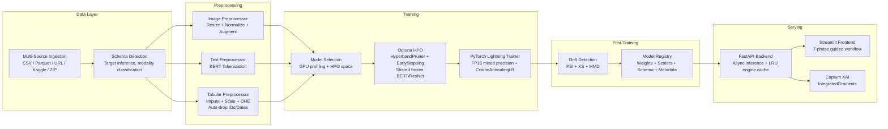

<p align="center">
  <h1 align="center">AutoVision+</h1>
  <p align="center">
    <strong>A Universal Multimodal AutoML Pipeline</strong><br>
    End-to-end automated machine learning for fused Image + Text + Tabular data,<br>
    with built-in hyperparameter optimization, drift detection, and explainability.
  </p>
</p>

<p align="center">
  
  
  
  
  
  
</p>

<p align="center">
  
  <br>
  <em>AutoVision+ guiding a user from multimodal data ingestion through schema detection, training, and XAI-powered prediction -- all from a single Streamlit interface.</em>
</p>

---

## Problem Statement

Training machine learning models on **multimodal data** (images, free-text, and structured tabular features) is an unsolved operational bottleneck:

1. **Data Fusion Friction** -- Most AutoML frameworks (Auto-sklearn, AutoGluon, FLAML) treat modalities in isolation. Practitioners must manually engineer cross-modal feature pipelines, reconcile preprocessing schemas, and build custom fusion heads -- a process that is error-prone, time-consuming, and non-repeatable.

2. **Compute Waste During HPO** -- Standard hyperparameter optimization loops instantiate heavyweight pretrained encoders (BERT: ~440 MB, ResNet-50: ~100 MB) *per trial*, exhausting GPU VRAM after 2--3 trials and causing silent OOM crashes or "zombie" trials that leak GPU memory without contributing to the search.

3. **Feature Leakage at Scale** -- Raw datasets contain ID columns, datetime stamps, and high-cardinality strings that survive default preprocessing pipelines. Models train on these noise features, achieve artificially high validation scores, and **fail catastrophically in production**.

4. **Black-Box Inference** -- After training, prediction UIs blindly ask users to fill in *every* column from the original dataset -- including leaked IDs and dates the model never used -- while providing **zero guidance** on expected input schema.

**AutoVision+** solves all four problems within a single, opinionated **7-phase pipeline** that automates the entire journey from raw multi-source data to deployed, explainable predictions.

---

## Scope

### What AutoVision+ Handles

- **Multi-format ingestion** across CSV, Parquet, image directories, ZIP archives, and Kaggle datasets
- **Multimodal preprocessing**: ResNet-50 for images, BERT tokenization for text, sklearn ColumnTransformer for tabular
- **Automatic feature leakage prevention**: heuristic ID/datetime/high-uniqueness column filtering before training
- **Cost-efficient HPO**: Optuna with HyperbandPruner and shared frozen encoders (single VRAM allocation across all trials)
- **Dual fusion strategies**: concatenation and learned attention-weighted fusion
- **Production-grade training**: PyTorch Lightning with FP16 mixed precision, EarlyStopping, stratified splits, and automatic class weighting
- **Statistical drift detection** (PSI, KS, MMD) with **autonomous retraining triggers**
- **Full artifact serialization** (weights, scalers, tokenizers, schemas) to a versioned model registry
- **Captum XAI** with auto-targeting of the predicted class
- **Schema-guided inference API** and **dynamic Streamlit frontend**

### What It Excludes

- Distributed multi-GPU / multi-node training (single-device only)
- Out-of-core datasets exceeding RAM (Polars/Dask lazy references are supported but materialized in-memory)
- Audio, video, or time-series modalities
- Production deployment orchestration (Kubernetes, model serving infrastructure)
- Automated feature engineering (feature interactions, polynomial expansion)

---

## Competitive Edge

Existing open-source AutoML tools leave a critical gap in multimodal fusion:

| Capability | Auto-sklearn | AutoGluon | FLAML | **AutoVision+** |
|---|:---:|:---:|:---:|:---:|
| Tabular AutoML | Yes | Yes | Yes | Yes |
| Image + Text + Tabular Fusion | No | Partial | No | **Yes** |
| Shared Frozen Encoders in HPO | N/A | No | N/A | **Yes** |
| Automatic ID/Date Column Filtering | No | No | No | **Yes** |
| Schema-Guided Inference UI | No | No | No | **Yes** |
| Statistical Drift Detection (PSI/KS/MMD) | No | No | No | **Yes** |
| XAI Auto-Targeting (Captum IG) | No | No | No | **Yes** |

AutoVision+'s core differentiator is treating **the entire lifecycle** -- from raw data ingestion through drift-triggered retraining -- as a single automated pipeline, rather than a collection of disconnected notebooks. The 7-phase orchestrator ensures that preprocessing state, feature contracts, and model provenance are serialized atomically, **eliminating the "training-serving skew"** that plagues ad-hoc ML workflows.

---

## Architecture

### Pipeline Flow



### Tech Stack

| Layer | Technology |
|---|---|
| **Core ML** | PyTorch 2.0, PyTorch Lightning, torchvision (ResNet-50), HuggingFace Transformers (BERT), torchmetrics |
| **AutoML / HPO** | Optuna (HyperbandPruner), MLflow (experiment tracking) |
| **Preprocessing** | scikit-learn (ColumnTransformer, StandardScaler, OHE), Pandas, NumPy |
| **Drift Detection** | SciPy (KS test), custom PSI + MMD implementations |
| **Explainability** | Captum (IntegratedGradients) |
| **Backend API** | FastAPI, Uvicorn, Pydantic |
| **Frontend** | Streamlit, Altair, Plotly |
| **Data I/O** | aiohttp (async downloads), Polars/Dask (lazy loading), joblib (serialization) |

---

## Implementation & Engineering Challenges

### 1. FinOps: Eliminating "Zombie Trial" GPU Compute Leak

**Problem:** When Optuna's HyperbandPruner prunes an underperforming trial mid-training, the pruned trial's model, CUDA tensors, and trainer graph remain allocated on the GPU -- a **"zombie trial"** that consumes VRAM without contributing to the search. After 2--3 pruned trials, the GPU is exhausted and subsequent trials crash with OOM.

**Solution:** Every HPO trial is wrapped in a **fail-safe GPU cleanup block** that executes unconditionally -- on success, error, *and* pruning. Non-winning trial artifacts are immediately offloaded from GPU, dereferenced, and force-collected. Only the current best model is retained in VRAM. Combined with **HyperbandPruner** (aggressively killing bottom-performing trials at intermediate epochs) and **EarlyStopping** (halting stalled training after 5 epochs of no improvement), **100% of GPU budget is directed toward promising configurations** -- zero compute is wasted on dead-end trials.

**Impact:** Enables **full HPO sweeps on a single consumer GPU** (8 GB VRAM) without OOM crashes, even when searching over multimodal architectures that include BERT and ResNet-50.

### 2. VRAM Optimization: Shared Frozen Encoders Across HPO Trials

**Problem:** A standard HPO loop instantiates `ImageEncoder(ResNet-50)` and `TextEncoder(BERT)` inside every trial. With **~540 MB** of identical, frozen weights per trial, a 10-trial search would require **5.4 GB** of redundant VRAM just for encoder copies.

**Solution:** Frozen BERT and ResNet-50 encoders are instantiated **exactly once** before the Optuna study begins and **shared by reference** across all trials. The encoders are excluded from the optimizer's parameter groups and from model checkpoints via a deliberate bypass of PyTorch's module registration system. This means each trial only allocates VRAM for its lightweight **fusion head (~2 MB)** while reusing the shared encoder pool.

**Impact:** **~99% reduction in per-trial VRAM overhead** (from ~540 MB to ~2 MB). A 10-trial multimodal HPO search that would have required ~6 GB of VRAM now fits within **~600 MB**, making enterprise-scale hyperparameter optimization feasible on **consumer-grade GPUs** and slashing cloud compute costs proportionally.

### 3. UI/API Parity: Zero-Friction Schema-Guided Inference

**Problem:** Raw training schemas include noise columns (IDs, timestamps, high-cardinality strings) that the preprocessor auto-filters during training. Without synchronization, the inference API expects these irrelevant columns, the frontend asks users to fill them in, and payloads fail validation -- causing **silent 500 errors** and user confusion.

**Solution:** A **3-layer contract** ensures training-time column decisions propagate automatically to inference:

1. **Preprocessing layer** -- Heuristic ID/datetime detection (regex name-pattern matching, uniqueness-ratio thresholds, datetime string probing) automatically filters noise columns. The surviving column list is persisted as `effective_features` inside the serialized preprocessor.

2. **API layer** -- The `/model-info` endpoint loads the fitted preprocessor and returns **only the columns the model actually uses**, plus a list of auto-dropped columns for transparency.

3. **Frontend layer** -- The Streamlit prediction form dynamically renders input fields for **effective features only**. Batch upload mode displays a schema requirements banner and offers a **downloadable CSV template** with the correct headers pre-filled.

**Impact:** **Zero schema mismatch errors** between training and inference. Users never see irrelevant fields, and batch uploads are validated against the exact feature contract before hitting the API.

### 4. Production Resilience: Automatic Class Imbalance Correction

**Problem:** Medical and industrial datasets are often heavily skewed (e.g., 95% healthy, 5% pathological). Training with uniform loss weights causes the model to **predict the majority class exclusively**, achieving high accuracy but zero clinical utility.

**Solution:** Before training begins, the pipeline automatically computes **inverse-frequency class weights** from the training split's target distribution. These weights are injected directly into the loss function -- `CrossEntropyLoss` for multiclass or `BCEWithLogitsLoss` with calibrated `pos_weight` for binary classification. **No user configuration is required**; the pipeline detects imbalance and compensates automatically.

**Impact:** Models trained on imbalanced datasets produce **calibrated predictions across all classes**, preventing majority-class collapse without manual intervention or external sampling strategies.

### 5. Cross-Platform GPU Safety

**Problem:** On Windows, long-running CUDA kernels trigger the **WDDM Timeout Detection & Recovery (TDR)** mechanism, causing hard GPU resets that terminate training mid-epoch with no recovery.

**Solution:** A GPU synchronization barrier is inserted after every training step, preventing any single kernel from exceeding the TDR timeout window. On Linux or CPU training, this is a no-op with **negligible overhead**.

**Impact:** **Reliable training on Windows workstations** without driver-level crashes -- critical for teams that develop locally before deploying to cloud GPUs.

### 6. Fault-Isolated Async Data Ingestion

**Problem:** Multi-source ingestion pipelines are fragile -- a single failed URL (404, timeout) can abort the entire data loading phase.

**Solution:** Downloads execute concurrently via **async I/O** with per-URL fault isolation. A failed source is logged and skipped; all remaining sources continue ingesting. **SHA-256 content hashing** provides automatic deduplication, so re-ingesting the same dataset is a **zero-cost cache hit** with no redundant network traffic.

**Impact:** **Resilient multi-source ingestion** that never fails completely due to a single unavailable data source, with automatic bandwidth savings on repeated runs.

---

## Results & Explainability

### Captum Integrated Gradients XAI

AutoVision+ integrates Captum's IntegratedGradients for **post-hoc model explanations across all modalities**:

- **Tabular:** Per-feature attribution scores showing which numeric/categorical inputs drove the prediction
- **Text:** Token-level attribution heatmaps highlighting the most influential words and subwords
- **Auto-Targeting:** The XAI target class defaults to **"Auto (Explain Predicted Class)"** -- the backend dynamically resolves this to the model's top prediction for each sample, eliminating the need to blindly pick from potentially 71+ classes *before* seeing the result

### Quantitative Results

[YET TO BE PROVIDED: Insert loss convergence charts (training loss vs. validation loss per epoch) for at least one benchmark dataset]

[YET TO BE PROVIDED: Insert comparative F1 / Accuracy / AUC-ROC scores across problem types (binary classification, multiclass, multilabel, regression)]

[YET TO BE PROVIDED: Insert HPO efficiency analysis -- trials pruned vs. completed, GPU-hours saved by shared encoders]

[YET TO BE PROVIDED: Insert drift detection validation -- PSI/KS/MMD scores on synthetically shifted test data]

---

## Limitations & Future Roadmap

### Current Limitations

1. **Single-Device Training** -- No distributed data parallelism. Training is limited to one GPU's memory capacity.
2. **In-Memory Materialization** -- Polars LazyFrame and Dask DataFrame references are accepted at ingestion, but materialized into Pandas DataFrames for preprocessing. Datasets exceeding available RAM will fail.
3. **Fixed Encoder Architectures** -- Image encoding is locked to ResNet-50; text to BERT-base. No automated encoder selection (e.g., ViT, DeBERTa).
4. **Conservative Default HPO Budget** -- Default trial count is tuned for interactive use. Production deployments should increase the search budget.
5. **No Streaming Inference** -- The API processes batch requests synchronously per-request; no WebSocket or gRPC streaming endpoint.

### Future Roadmap

| Priority | Enhancement | Description |
|---|---|---|
| P0 | **Feature Pre-computation for Frozen Encoders** | Cache BERT/ResNet embeddings to disk after the first forward pass, eliminating redundant encoder inference across HPO trials and retraining runs |
| P0 | **Advanced SHAP Integration** | Add KernelSHAP and DeepSHAP alongside IntegratedGradients for richer, method-comparative explanations |
| P1 | **Encoder Selection** | Auto-select vision backbone (ResNet-50 / EfficientNet / ViT) and text encoder (BERT / DeBERTa / sentence-transformers) based on dataset characteristics |
| P1 | **Distributed Training** | PyTorch Lightning DDPStrategy for multi-GPU scaling |
| P2 | **Streaming Inference** | WebSocket endpoint for real-time prediction streams |
| P2 | **Time-Series Modality** | Add temporal encoder (LSTM / Transformer) for sequential data fusion |
| P3 | **Deployment Export** | ONNX / TorchScript export with integrated pre/post-processing for edge deployment |

---

## Quick Start

### Prerequisites

- Python 3.10+
- CUDA 11.8+ (optional, for GPU training)

### Installation

```bash
# Clone the repository
git clone https://github.com/hrishi-cz/main-project.git
cd main-project

# Create virtual environment
python -m venv venv
source venv/bin/activate        # Linux/macOS
# venv\Scripts\activate         # Windows

# Install dependencies
pip install -r requirements.txt
```

### Running the Platform

**Terminal 1 -- Backend API:**
```bash
python run_api.py
# FastAPI server starts on http://localhost:8000
# API docs available at http://localhost:8000/docs
```

**Terminal 2 -- Frontend UI:**
```bash
streamlit run frontend/app_enhanced.py
# Streamlit app opens at http://localhost:8501
```

### Project Structure

```
main-project/
├── run_api.py                     # FastAPI entrypoint (all endpoints)
├── requirements.txt               # Pinned dependencies
├── frontend/
│   └── app_enhanced.py            # Streamlit 7-phase UI
├── pipeline/
│   ├── training_orchestrator.py   # 7-phase orchestration engine
│   ├── inference_enginee.py       # Multimodal inference + XAI
│   ├── dataset_manager.py         # Lazy dataset registry
│   └── retraining_pipeline.py     # Drift-triggered retraining
├── automl/
│   ├── trainer.py                 # PyTorch Lightning module + factory
│   ├── advanced_selector.py       # GPU-aware model selection
│   └── model_selector.py          # Selection API wrapper
├── modelss/
│   ├── encoders/
│   │   ├── image.py               # ResNet-50 backbone + projection
│   │   ├── text.py                # BERT encoder + CLS pooling
│   │   └── tabular.py             # Pass-through tabular encoder
│   ├── fusion.py                  # Concatenation + Attention fusion
│   └── predictor.py               # Multimodal predictor (legacy)
├── preprocessing/
│   ├── tabular_preprocessor.py    # ColumnTransformer + ID/date filtering
│   ├── text_preprocessor.py       # BERT tokenizer wrapper
│   └── image_preprocessor.py      # torchvision transforms
├── data_ingestion/
│   ├── ingestion_manager.py       # Async multi-URL ingestion
│   ├── schema_detector.py         # Universal schema inference
│   ├── loader.py                  # Multi-format data loader
│   └── adapters/                  # Domain-specific adapters (ECG, etc.)
├── monitoring/
│   ├── drift_detector.py          # PSI / KS / MMD drift detection
│   └── performance_tracker.py     # Real-time metric tracking
├── config/
│   └── hyperparameters.py         # HPO search space configuration
└── model_registry_pkg/
    └── model_registry.py          # Model versioning utilities
```

---

<p align="center">
  Built with PyTorch Lightning, FastAPI, and Streamlit
</p>
